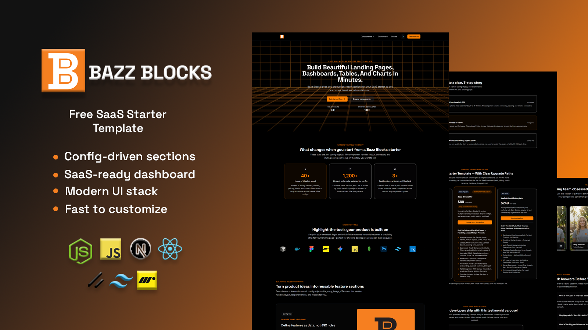
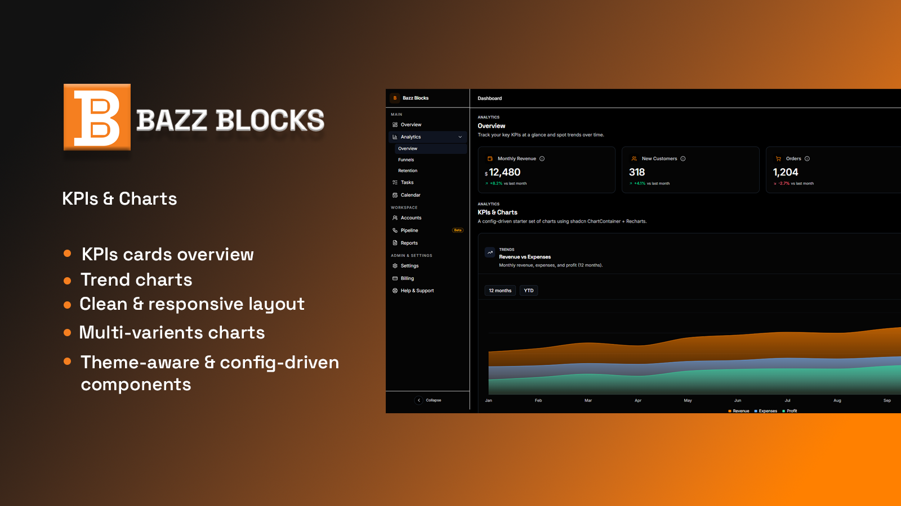

# Bazz Blocks SaaS Starter — Free Next.js SaaS Starter Kit (Dashboard + CRUD + Charts)

## Introduction

**Bazz Blocks SaaS Starter** is a **free, config-driven UI starter** for building modern SaaS products with **Next.js (App Router)**. It ships with a polished **marketing landing page** plus a starter **dashboard experience** (CRUD-style table + KPIs + charts) so you can launch faster and iterate confidently.

This repo is intentionally **simple and beginner-friendly** — one solid, opinionated version of each section — while keeping the codebase clean enough to extend into a full product.

## Live Demo
Explore the deployed demo here: **https://bazz-blocks-saas-starter.vercel.app/**

## Why This Starter Exists

Most “SaaS starters” either:
- give you a basic layout with no real sections, or
- ship overly complex abstractions that are hard to customize.

**Bazz Blocks SaaS Starter** focuses on what actually helps you ship:
- **Section-first UI** (marketing blocks you can plug in immediately)
- **Dashboard-ready foundation** (CRUD-style table + analytics starter)
- **Config-driven content** (update data/config instead of rewriting components)
- **Clean, modern defaults** that are easy to extend into your own product

## What’s included (Free Starter)

### Marketing site sections
A clean marketing site built from reusable, section-first blocks:
- **Hero**
- **Logo strip / social proof**
- **Features**
- **Stats**
- **Workflow / steps**
- **Pricing**
- **Testimonials**
- **FAQs**
- **Footer**

### Dashboard starter

A lightweight dashboard foundation to help you build real SaaS screens faster:

**Includes:**
- **Dashboard shell layout** (sidebar + content)
- **CRUD-style table experience** (starter-ready)
- **Page-level structure** you can extend into modules (Customers, Orders, Products, etc.)

**Table features:**
- **Search + filters**
- **Sortable columns**
- **Pagination**
- **Row actions ready**

### KPIs & Charts

A starter analytics view to visualize product performance at a glance:

**Includes:**
- **KPI cards** for quick overview (totals, growth, comparisons)
- **Charts dashboard** (clean, responsive layout)
- **Config-driven datasets** (easy to swap demo data with real data later)
- **Reusable chart wrappers** you can extend with more chart types

## Bazz Blocks Pro (Coming soon)

This starter is the **free base layer** — simple, opinionated, and easy to extend.

**Bazz Blocks Pro** is the full production-grade UI system we’re building on top of this, designed for teams shipping real SaaS products faster:

- **Multiple variants per section** (more heroes, pricing layouts, FAQs, feature grids, etc.)
- **Deeper customization controls** (layout density, spacing, tones, themes, content patterns)
- **Better dashboard building blocks** (more shells, headers, nav patterns, page templates)
- **Advanced CRUD table kit** (richer filters, column controls, bulk actions, better UX patterns)
- **More charts + analytics components** (more chart types, nicer defaults, extensible wrappers)
- **Polish & consistency** (motion presets, UI patterns, better documentation + examples)

If you like the direction of this starter, **star the repo** to follow updates and upcoming releases.

## Tech stack

Built with a modern, production-friendly stack:

- **Next.js (App Router)**
- **React**
- **Tailwind CSS v4**
- **shadcn/ui**
- **Framer Motion**
- **Recharts**
- **Vercel (deployment)**

### Stack icons

## How the “config-driven” approach works

Instead of hardcoding copy and UI content inside components, most sections in this starter are driven by **simple config objects**.

That means you can:
- update headings, subtitles, buttons, links, and lists in one place
- reuse the same section component across pages
- keep components clean, reusable, and content-agnostic

**Typical flow:**
1. Open the relevant config file (e.g. `config/marketing/*` or `config/dashboard/*`)
2. Edit the object (text, CTAs, items, chart data, etc.)
3. The UI updates automatically — no deep JSX editing required

## Contributing

Contributions are welcome! 🎉  
If you’d like to improve **bazz-blocks-saas-starter**, feel free to open an issue or submit a pull request.

### What to contribute
Good first contributions include:
- Bug fixes and small UI improvements
- Docs improvements (README, comments, usage examples)
- New **base** sections or blocks (starter-friendly)
- Better responsiveness and accessibility tweaks

### Contribution guidelines
When adding or updating components, please keep them:
- **Config-driven** (no hardcoded marketing copy)
- **Single-variant** (base version should stay simple)
- **Beginner-friendly** (clean code, readable props)
- **Stack-aligned** (Next.js App Router, Tailwind v4, shadcn/ui)

## License

This project is licensed under the **MIT License** — you’re free to use, modify, and distribute it in personal or commercial projects.

See the `LICENSE` file for full details.

